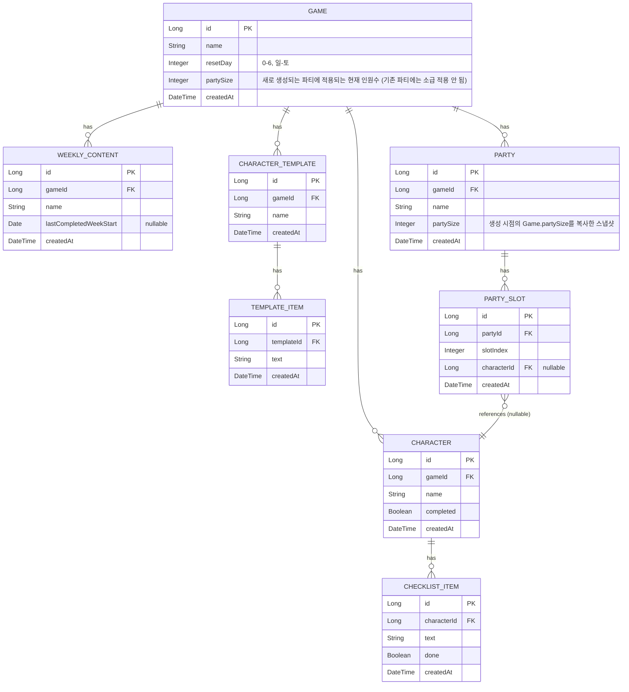

# 03. ERD 및 데이터 모델 명세

용어는 `02-domain-glossary.md` 기준. 아래 ERD는 초안이며, API 설계(`04-api-spec.md`) 과정에서 조정될 수 있다.

## ER 다이어그램

## 관계 요약

| 관계 | 설명 |
|---|---|
| Game 1 : N Character | 게임 삭제 시 캐릭터도 함께 삭제 (cascade) |
| Game 1 : N WeeklyContent | 게임 삭제 시 함께 삭제 |
| Game 1 : N CharacterTemplate | 게임 삭제 시 함께 삭제 (템플릿은 게임 종속적) |
| Game 1 : N Party | 게임 삭제 시 함께 삭제 |
| Character 1 : N ChecklistItem | 캐릭터 삭제 시 함께 삭제 |
| CharacterTemplate 1 : N TemplateItem | 템플릿 삭제 시 함께 삭제 |
| Party 1 : N PartySlot | 파티 삭제 시 함께 삭제 |
| PartySlot N : 1 Character (nullable) | 캐릭터 삭제 시 해당 슬롯은 null로 처리 (파티 자체는 유지) |

## 설계 메모

- **주간 리셋 계산은 저장하지 않고 매 조회 시 계산하는 방식도 검토 대상.**
  `WeeklyContent.lastCompletedWeekStart`만 저장해두고, "이번 주 완료 여부"는 서비스 레이어에서
  `Game.resetDay`와 오늘 날짜를 기준으로 매 요청마다 계산해서 응답 DTO에 `completedThisWeek: boolean`으로 내려주는 방식을 1순위로 고려.
- **`PartySlot` 개수는 소속 게임의 `partySize`가 아니라, 소속 파티 자신의 `partySize` 스냅샷을 따른다 (결정 완료).**
  파티 생성 시점에 `Game.partySize` 값을 그대로 복사해 `Party.partySize`에 저장해두고, 이후 `PartySlot` 생성·검증은 전부 이 스냅샷 값을 기준으로 한다.
  이렇게 하면 `Game.partySize`가 나중에 바뀌어도 이미 만들어진 파티는 영향을 받지 않고(자기 값을 그대로 유지),
  새로 만드는 파티부터만 바뀐 값을 따라간다 — 흔히 쓰는 "스냅샷" 패턴(예: 주문 시점 가격을 주문 항목에 복사해두는 것)과 같은 원리다.
  `PartySlot`을 별도 테이블로 둘지, `Party`에 캐릭터 ID 배열(JSON 컬럼)로 둘지는 여전히 미정 —
  다만 어느 쪽을 택하든 슬롯 "개수"는 `Party.partySize`를 기준으로 정해진다는 점은 확정.
- **ChecklistItem, TemplateItem은 별도 정렬 필드 없이 `id` 오름차순으로 정렬한다 (결정 완료).**
  재정렬(드래그로 순서 변경) 기능은 현재 프론트엔드에도 없고 필요성도 낮다고 판단해 API로 지원하지 않기로 했다.
  생성 순서만 보장되면 되므로 `sortOrder` 컬럼은 만들지 않고, 자동 증가 `id`를 그대로 정렬 기준으로 쓴다
  (`createdAt` 타임스탬프보다 `id`가 더 안전하다 — 동시 요청으로 타임스탬프가 같아지는 경우에도 `id`는 항상 유일하게 순서를 보장한다).
  조회 시 서비스 레이어에서 `ORDER BY id ASC`를 명시해 JPA의 순서 미보장 문제를 해결한다.
- **PartySlot에는 (partyId, slotIndex) 조합의 유니크 제약이 필요하다.**
  같은 파티 안에서 슬롯 인덱스가 중복되지 않도록 DB 레벨에서 보장한다.
- **(해결) 게임의 `partySize`를 나중에 변경해도 기존 파티는 영향받지 않는다.**
  위 `Party.partySize` 스냅샷 결정으로 해결됨 — 기존 파티는 자신의 스냅샷 값을 그대로 쓰므로 `Game.partySize` 변경과 무관하다 (`01-requirements.md` 7절, `04-api-spec.md` 참고).
- **(확장 메모) 인증 도입 시 `Game`에 `ownerId`(FK → User) 추가 예정.**
  MVP는 인증 없이 개발하기로 결정했다 (`01-requirements.md` 참고). 여러 사용자를 지원하게 되면
  `Game` 테이블에 `ownerId`를 추가하고, `Character`/`WeeklyContent`/`CharacterTemplate`/`Party`는
  `Game`을 통해 간접적으로 소유권이 결정되므로 별도 FK 없이도 사용자 분리가 가능하다.
  지금 컬럼을 미리 만들지는 않는다.

## TBD

- [x] ~~PK 타입: `Long`(auto increment) 확정 여부~~ → **결정: `Long`** (기존 Spring Boot 포트폴리오 프로젝트들과 일관성 유지)
- [x] ~~`Game.createdAt` 외에 `updatedAt` 등 감사(auditing) 컬럼을 어디까지 넣을지~~ → **결정: `createdAt`은 전 엔티티에 일괄 적용(JPA Auditing), `updatedAt`은 MVP에서 미도입**
- [x] ~~`PartySlot`을 별도 테이블로 둘지, `Party`에 JSON 컬럼으로 둘지~~ → **결정: 정규화 테이블** (슬롯 단위 PATCH API 구현 단순화, DB 레벨 무결성 관리 위해)
- [x] ~~soft delete(삭제 플래그) vs hard delete 여부~~ → **결정: 전 엔티티 하드 삭제로 통일** (현재 프론트엔드와 동일한 방식 유지, `01-requirements.md` 6절 참고)
