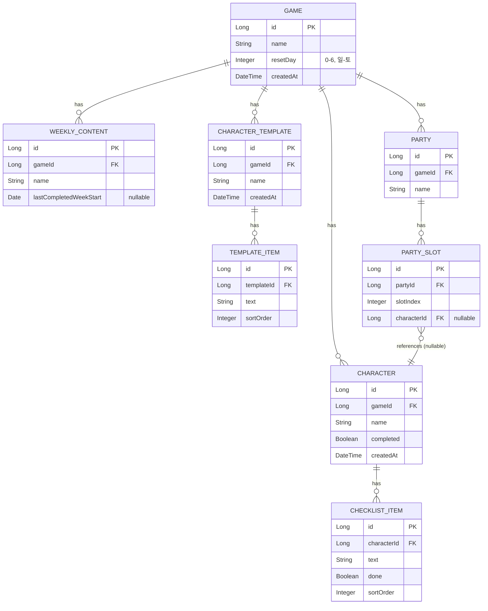

# 03. ERD 및 데이터 모델 명세

용어는 `02-domain-glossary.md` 기준. 아래 ERD는 초안이며, API 설계(`04-api-spec.md`) 과정에서 조정될 수 있다.

## ER 다이어그램

## 관계 요약

| 관계 | 설명 |
|---|---|
| Game 1 : N Character | 게임 삭제 시 캐릭터도 함께 삭제 (cascade) |
| Game 1 : N WeeklyContent | 게임 삭제 시 함께 삭제 |
| Game 1 : N CharacterTemplate | 게임 삭제 시 함께 삭제 (템플릿은 게임 종속적) |
| Game 1 : N Party | 게임 삭제 시 함께 삭제 |
| Character 1 : N ChecklistItem | 캐릭터 삭제 시 함께 삭제 |
| CharacterTemplate 1 : N TemplateItem | 템플릿 삭제 시 함께 삭제 |
| Party 1 : N PartySlot | 파티 삭제 시 함께 삭제 |
| PartySlot N : 1 Character (nullable) | 캐릭터 삭제 시 해당 슬롯은 null로 처리 (파티 자체는 유지) |

## 설계 메모

- **주간 리셋 계산은 저장하지 않고 매 조회 시 계산하는 방식도 검토 대상.**
  `WeeklyContent.lastCompletedWeekStart`만 저장해두고, "이번 주 완료 여부"는 서비스 레이어에서
  `Game.resetDay`와 오늘 날짜를 기준으로 매 요청마다 계산해서 응답 DTO에 `completedThisWeek: boolean`으로 내려주는 방식을 1순위로 고려.
- **PartySlot을 별도 테이블로 둘지, Party에 캐릭터 ID 배열(JSON 컬럼)로 둘지는 미정.**
  정규화된 구조(현재 ERD)가 조회/변경에 더 명확하지만, 슬롯 개수가 고정적이라면 JSON 컬럼도 실용적인 대안.
- **ChecklistItem, TemplateItem의 `sortOrder`는 현재 프론트엔드엔 없는 개념.**
  지금은 배열 순서를 그대로 쓰고 있어서, 이 순서를 유지하려면 백엔드에 정렬 필드가 필요함 — MVP에서 반영할지 결정 필요.

## TBD

- [ ] PK 타입: `Long`(auto increment) 확정 여부 (02-domain-glossary.md TBD와 연동)
- [ ] `Game.createdAt` 외에 `updatedAt` 등 감사(auditing) 컬럼을 어디까지 넣을지
- [ ] soft delete(삭제 플래그) vs hard delete 여부 — 현재 프론트엔드는 즉시 완전 삭제 방식
